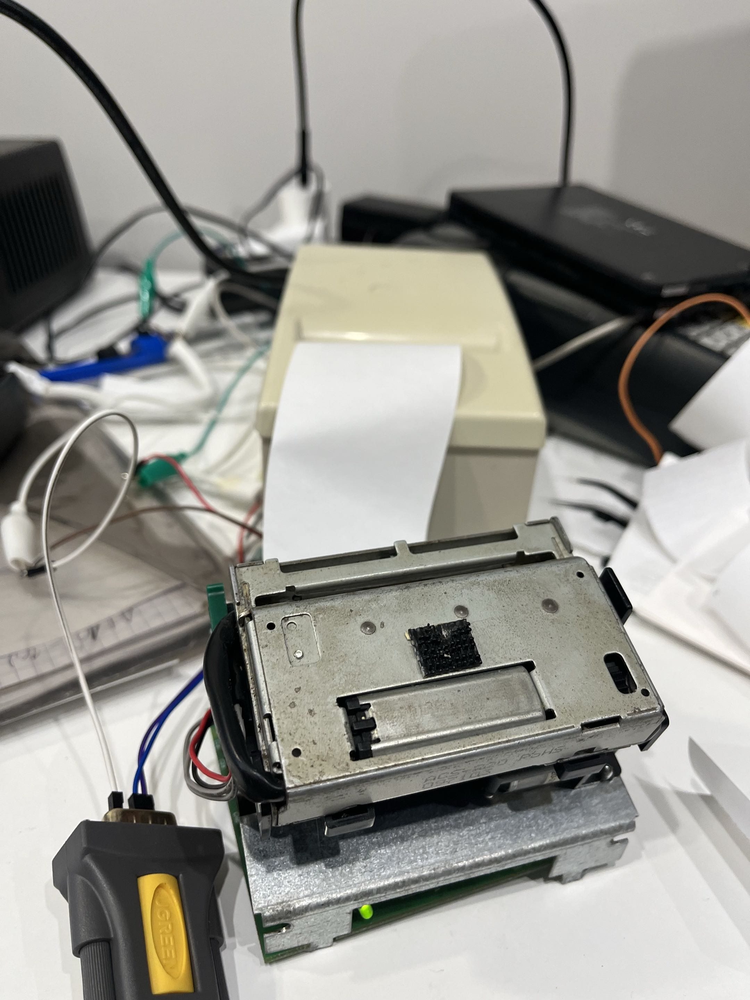
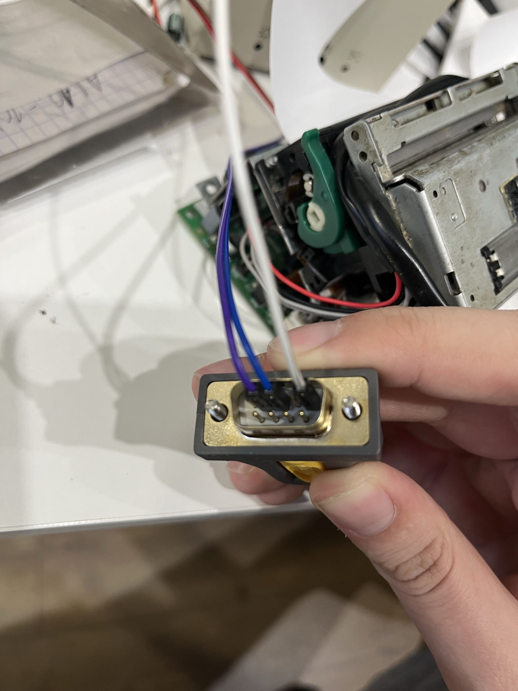
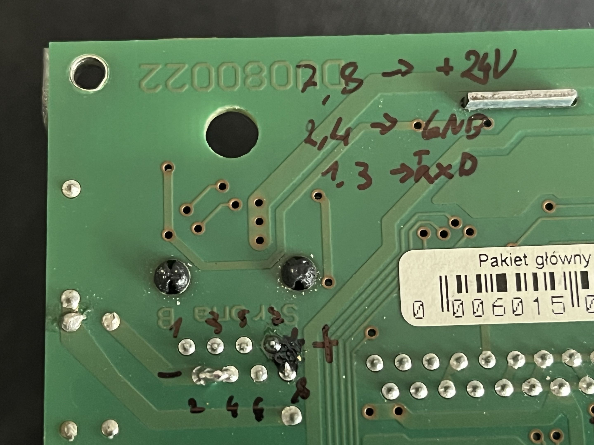

# Elzab Talos printer Python module

## PL
Prosty moduł do pythona do sterowania drukarki.
Podłączyłem tą drukarkę do komputera przez konwerter USB - RS232 UGREEN CR104
Ponieważ, że nie posiadam oryginalnego kabla, sam przylutowałem kable do złącza z tyłu PCB do odpowiednich pinów:
- 7 i 8 - +24V
- 2 i 4 - GND
- 1 - TxD
- 3 - RxD

Oczywiście podłączyłem GND z samego konwertera do drukarki.

## EN
Simple module for controlling the printer.
I connected this printer to computer using UGREEN CR104 USB - RS232 converter
Because i don't have the original cable, i soldered wires to the back of the PCB to pins:
- 7 i 8 - +24V
- 2 i 4 - GND
- 1 - TxD
- 3 - RxD

I connected the common ground from the converter to the printer too.

## Obrazy / Images

